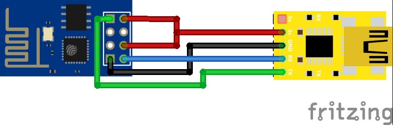
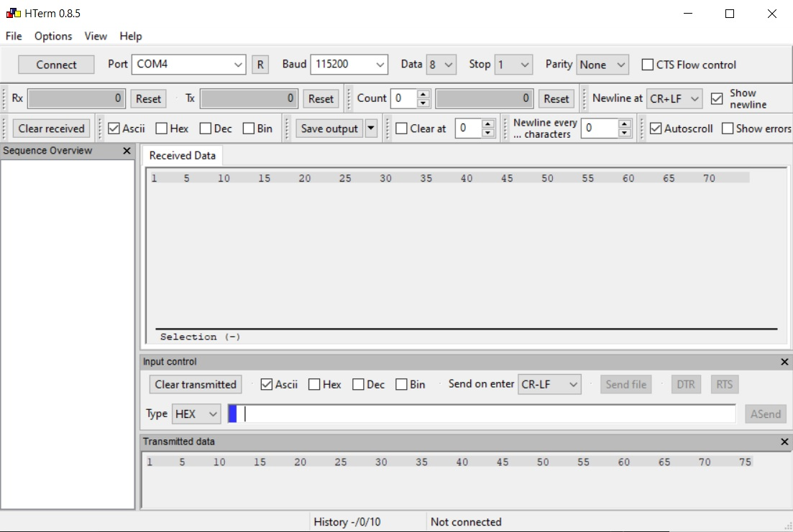
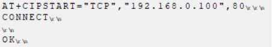
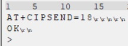
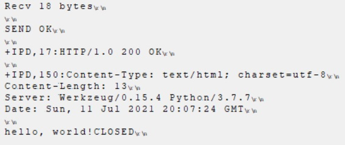

# Requições HTTP com comandos AT


## 1. Rodar servidor flask

Execute o servidor flask contido no mesmo arquivo deste .md
```
python flask_testes.py
```

Entre no navegador e digite **localhost**, para ver se o servidor está funcionando corretamente

## 2. Circuito elétrico do ESP-01 num USB TTL

Monte o cirucito abaixo:


Conecte o circuito ao USB do computador e abra o monitor serial do aduino. Configureo da seguinte maneira:


Digite AT no monitor serial, se aparecer a resposta OK então o módulo está funcionando corretamente.
```
AT

OK
```

## 3. Monitor Serial hterm

baixar e instalar o [hterm](https://alternativeto.net/software/hterm/about/)

configurar o hterm da seguinte forma:


## 4. Testando hterm

Copie e cole o respectivo comando em hexadecimal no campo _input control_ do hterm e pressione enter para enviá-lo.

Feche o serial monitor do arduino, conecte o hterm na porta COM que você plugou seu módulo, esta informação pode ser encontrada no gerenciador de dispositivos, na seção de dispositivos usb.

Teste a conexão com o hterm enviando o comando hex abaixo.
```
AT
41 54
```

## 5. Conectando a um WIFI

5.1 Colocando o módulo em modo cliente wifi
```
AT+CWMODE=1
41 54 2b 43 57 4d 4f 44 45 3d 31
```

5.2 Conectando a um wifi, para esta etapa substitua o SSID e SENHA pelas credenciais do sue wifi. Em seguida copie o comando ASCII neste [site](https://www.rapidtables.com/convert/number/ascii-to-hex.html) para descobrir seu comando em hex. Copie e cole seu comando hex no hterm para conectars-se
```
AT+CWJAP="SSID","SENHA"
41 54 2b 43 57 4a 41 50 3d 22 42 42 47 5f 4a 4f 53 45 4c 49 54 4f 22 2c 22 74 65 73 74 65 22
```

[opicional] Se quiser desconectar desse wifi, use o comando abaixo
```
AT+CWQAP
41 54 2b 43 57 51 41 50
```

5.3 Checando IP e MAC do módulo
```
AT+CIFSR
41 54 2b 43 49 46 53 52
```
##  6. Enviando requisição HTTP

Uma vez conectado num wifi e com o servidor flask rodando, use os comandos abaixo.

6.1 Use o ipconfig para descobrir o ip da máquina cujo servidor flask está hospedado. substitua este ip no comando ASCII abaixo e descubra seu respectivo HEX neste [site](https://www.rapidtables.com/convert/number/ascii-to-hex.html). Use seu comando HEX para abrir uma conexão TCP com o servidor flask.
```
AT+CIPSTART="TCP","192.168.0.100",80
41 54 2b 43 49 50 53 54 41 52 54 3d 22 54 43 50 22 2c 22 31 39 32 2e 31 36 38 2e 30 2e 31 30 30 22 2c 38 30
```

indicacao de que a conexao ocorreu com sucesso:


6.2 O primeiro comando indica a quantidade de bytes a serem enviados ao servidor. Para requisições HTTP serem reconhecidas corretamente, elas precisam ter a sequência de bytes ao final do corpo da requisição TCP **0x0D 0X0A 0x0D 0X0A**. Sua requisição terá a quantidade de caracteres que julgar necessário + 4 bytes. Envie o AT abaixo indicando ao servidor quantos bytes ele deve esperar receber. No exemplo abaixo será enviado texto **GET / HTTP/1.1**, que possui 14 bytes, logo 14+4 equivalem a 18 bytes. Como na etapa 6.1, descobra seu comando HEX a partir do ASCII e execute-o no hterm.
```
AT+CIPSEND=18
41 54 2b 43 49 50 53 45 4e 44 3d 31 38
```

a saida experada é que apareça o >, simbolizando que o servidor está aguardando receber a quantidade de bytes que você indicou anteriormente



6.3 Descubra o HEX do texto ASCII da sua requisição http e cole os bytes **0d 0a 0d 0a** ao final dela. cole no hterm e pressione enter para enviar a requisição.
``` 
GET / HTTP/1.1\r\n\r\n
47 45 54 20 2f 20 48 54 54 50 2f 31 2e 31 0d 0a 0d 0a
```

se a requisição funcionar, este log irá aparecer no hterm.


e este log deverá aparecer no servidor.


## Próximos passos

fazer requisições POST e testar conexões com https